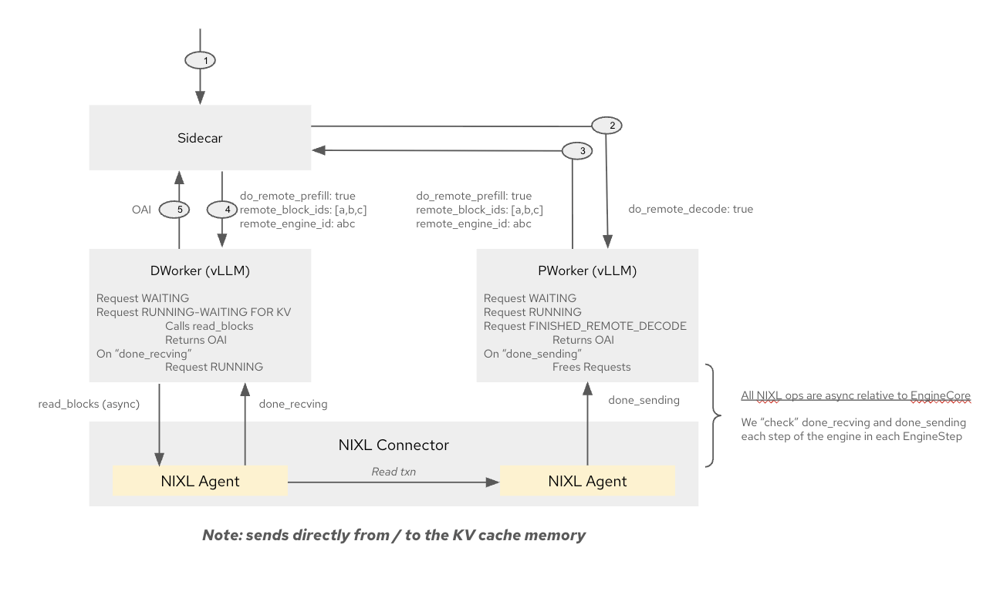

# Disaggregated Prefill/Decode Inference Serving in llm-d

## Overview

This document describes the architecture and request lifecycle for enabling **disaggregated prefill and decode (P/D)** inference execution in the llm-d router. The architecture aims to improve flexibility, scalability, and performance by enabling separation of prefill and decode stages onto different workers.

This evolved version removes the requirement for sidecars on the **prefill node**, simplifying deployment while maintaining orchestration from the **decode node**.

---

## Goals

- Enable routing of prefill and decode to different pods
- Maintain low latency and high throughput
- Improve resource utilization by specializing pods for prefill or decode
- Align with GIE-compatible architectures for potential upstreaming

---

## Key Components

| Component            | Role                                                                 |
|----------------------|----------------------------------------------------------------------|
| **Prefill Worker**   | Handles only prefill stage using vLLM engine                         |
| **Decode Worker**    | Handles decode stage and contains the sidecar for coordination       |
| **Sidecar (Decode)** | Orchestrates communication with prefill worker and manages lifecycle |
| **Envoy Proxy**      | Accepts OpenAI-style requests and forwards them to EPP               |
| **EPP**              | End Point Picker, makes scheduling decisions                     |

---

## Request Lifecycle

1. **User Request**
   - Sent via OpenAI API to the Envoy Proxy

2. **EPP Scheduling Decision**
   - EPP evaluates:
     - Prompt length
     - KV cache hit probability
     - System and pod load
   - Selects either:
     - **Single node** path (decode handles all)
     - **Split node** path (distinct prefill and decode workers)
   - Returns Decode Worker (always), and optionally Prefill Worker URL

3. **Execution**
   - Request lands on Decode Worker (as selected by EPP)
   - Decode sidecar coordinates:
     - If `prefill_worker_id == nil`, runs both stages locally by passing request to local vllm
     - If split:
       - Sends prefill job to Prefill Worker with a special header `do_remote_decode=true`
       - Upon receiving response from Prefill Worker runs decode stage 

4. **Response Flow**
   - Response flows from decode sidecar → Envoy → EPP → User

---

## Architectural Details

### Sidecar Responsibilities (Decode Only)

- Receives EPP metadata (decode pod, optional prefill pod)
- Sends request to prefill
- Waits and validates result
- Launches local decode job
- Sends final response

> **Note**: No sidecar or coordination logic is needed on the prefill node.

---

## Worker Selection Logic

- **Decode Worker**:
  - Prefer longest prefix match / KV cache utilization (depends on avaialble scorers)

- **Prefill Worker**:
  - High prefix-cache hit rate
  - Low load

> **Skip prefill worker** when:
> - Prefix match/kv cache hit is high
> - Prompt is very short

---

## vLLM and LMCache Integration

- **vLLM changes** (or wrapper APIs):
  - `save()`, `load()` APIs
  - `done_sending`, `done_receiving`
  - Connector API supporting async transfer

---

## Drawbacks & Limitations

- Slight increase in TTFT for split P/D
- Possibility of stranded memory on prefill crash
- Need for timeout and retry logic

---

## Design Benefits

- **Flexibility**: Enables per-request specialization and resource balancing
- **Scalability**: Clean separation of concerns for easier ops and tuning
- **Upstream-ready**: Follows GIE-compatible request handling
- **Minimal Changes**: Only decode node includes orchestration sidecar

---

## Future Considerations

- Cache coordinate
- Pre allocation of kv blocks in decode node , push cache from prefill to decode worker during calculation

---

## Diagram 

---

## References
